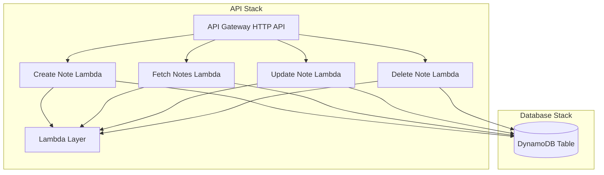

# Serverless Notes CRUD Application Documentation

## Architecture Overview

The application consists of two main components deployed as separate CloudFormation stacks:

1. **Database Stack** (`serverless-notes-db`)
   - DynamoDB table for storing notes
   - Exports table name and ARN for API stack consumption

2. **API Stack** (`serverless-notes-api`)
   - API Gateway HTTP API
   - Lambda functions for CRUD operations
   - Lambda layers for dependencies
   - IAM roles and permissions

### Architecture Diagram



## API Documentation

Base URL: `https://pwp1jfaysk.execute-api.us-east-1.amazonaws.com/`

### Create Note
- **Endpoint**: `POST /notes`
- **Content-Type**: `application/json`
- **Request Body**:
  ```json
  {
    "content": "string",
    "tags": ["string"],
    "sender": "string",
    "shouldExpire": boolean
  }
  ```
- **Description**: Creates a new note with the specified content, tags, sender, and expiration setting.

### Fetch Notes
- **Endpoint**: `GET /notes`
- **Query Parameters**:
  - `limit`: Number of notes to return (default: 10)
  - `nextToken`: Pagination token for next set of results
- **Description**: Retrieves a list of notes with optional pagination.

### Update Note
- **Endpoint**: `PUT /notes/{id}`
- **Content-Type**: `application/json`
- **Request Body**:
  ```json
  {
    "content": "string",
    "tags": ["string"],
    "sender": "string",
    "shouldExpire": boolean
  }
  ```
- **Description**: Updates an existing note with the specified ID.

### Delete Note
- **Endpoint**: `DELETE /notes/{id}`
- **Description**: Deletes the note with the specified ID.

## Technical Details

### Database Schema
- **Table Name**: NotesTable
- **Primary Key**:
  - Partition Key (HASH): `pk` (String)
  - Sort Key (RANGE): `sk` (String)
- **TTL**: Enabled on `ttl` attribute

### Lambda Configuration
- **Runtime**: Node.js 20.x
- **Architecture**: ARM64
- **Memory**: 512MB
- **Timeout**: 5 seconds
- **Layers**:
  - Dependencies layer
  - AWS Lambda Powertools TypeScript V2
