# 📝 Serverless Notes CRUD Application Documentation

## 🏗️ Architecture Overview

The application consists of two main components deployed as separate CloudFormation stacks:

1. **Database Stack** (`serverless-notes-db`)
   - DynamoDB table for storing notes
   - Exports table name and ARN for API stack consumption

2. **API Stack** (`serverless-notes-api`)
   - API Gateway HTTP API
   - Lambda functions for CRUD operations
   - Lambda layers for dependencies
   - IAM roles and permissions

### Architecture Diagram

```mermaid
graph TD
    subgraph API Stack
        APIGW[API Gateway HTTP API]
        CreateLambda[Create Note Lambda]
        FetchLambda[Fetch Notes Lambda]
        UpdateLambda[Update Note Lambda]
        DeleteLambda[Delete Note Lambda]
        LambdaLayer[Lambda Layer]
    end

    subgraph Database Stack
        DynamoDB[(DynamoDB Table)]
    end

    Client[Client] -->|HTTP Request| APIGW
    APIGW -->|POST /notes| CreateLambda
    APIGW -->|GET /notes| FetchLambda
    APIGW -->|PUT /notes/&#123;id&#125;| UpdateLambda
    APIGW -->|DELETE /notes/&#123;id&#125;| DeleteLambda
    
    CreateLambda --> LambdaLayer
    FetchLambda --> LambdaLayer
    UpdateLambda --> LambdaLayer
    DeleteLambda --> LambdaLayer
    
    CreateLambda -->|PutItem| DynamoDB
    FetchLambda -->|Query| DynamoDB
    UpdateLambda -->|UpdateItem| DynamoDB
    DeleteLambda -->|DeleteItem| DynamoDB
```



## 🚀 Getting Started

### Prerequisites

- Node.js v20 or later
- AWS CLI configured with appropriate credentials
- Serverless Framework CLI installed (`npm install -g serverless`)

### Installation

1. Clone the repository:
   ```
   git clone https://github.com/yourusername/serverless-notes-crud.git
   cd serverless-notes-crud
   ```

2. Install dependencies:
   ```
   cd api
   npm install
   ```

## 🌐 API Documentation

Base URL: `https://pwp1jfaysk.execute-api.us-east-1.amazonaws.com/`

### Create Note

- **Method**: `POST`
- **Endpoint**: `/notes`
- **Content-Type**: `application/json`
- **Request Body**:
  ```json
  {
    "content": "string",
    "tags": ["string"],
    "sender": "string",
    "shouldExpire": boolean
  }
  ```
- **Response**: `201 Created`
  ```json
  {
    "id": "string",
    "content": "string",
    "tags": ["string"],
    "sender": "string",
    "shouldExpire": boolean,
    "createdAt": "string",
    "updatedAt": "string"
  }
  ```

### Fetch Notes

- **Method**: `GET`
- **Endpoint**: `/notes`
- **Query Parameters**:
  - `limit`: Number of notes to return (default: 10)
  - `nextToken`: Pagination token for next set of results
- **Response**: `200 OK`
  ```json
  {
    "notes": [
      {
        "id": "string",
        "content": "string",
        "tags": ["string"],
        "sender": "string",
        "shouldExpire": boolean,
        "createdAt": "string",
        "updatedAt": "string"
      }
    ],
    "token": "string"
  }
  ```

### Update Note

- **Method**: `PUT`
- **Endpoint**: `/notes/{id}`
- **Content-Type**: `application/json`
- **Request Body**:
  ```json
  {
    "content": "string",
    "tags": ["string"],
    "sender": "string",
    "shouldExpire": boolean
  }
  ```
- **Response**: `200 OK`
  ```json
  {
    "id": "string",
    "content": "string",
    "tags": ["string"],
    "sender": "string",
    "shouldExpire": boolean,
    "createdAt": "string",
    "updatedAt": "string"
  }
  ```

### Delete Note

- **Method**: `DELETE`
- **Endpoint**: `/notes/{id}`
- **Response**: `200 OK`
  ```json
  {
    "message": "Note deleted successfully"
  }
  ```

## 💻 Local Development

To develop and test locally:

1. Install dependencies in both root and api directories:
   ```
   npm install
   cd api && npm install
   ```

2. Start the local development server:
   ```
   cd api
   npm run serverless dev
   ```

3. Test API endpoints using the provided HTTP file:
   ```
   cd docs
   # Use REST Client extension in VS Code to execute requests in api.http
   ```

## 🚢 Deployment

The application can be deployed using the Serverless Framework:

### Manual Deployment

1. Deploy the database stack first:
   ```
   cd db
   serverless deploy --stage dev --aws-profile your-profile
   ```

2. Deploy the API stack:
   ```
   cd api
   serverless deploy --stage dev --aws-profile your-profile
   ```

### CI/CD Pipeline

The repository includes GitHub Actions workflows for automated CI/CD:

- Pull Requests: Runs linting and type checking
- Push to `develop`: Deploys to development environment
- Push to `main`: Deploys to production environment

## 🛠️ Technical Details

### Database Schema

- **Table Name**: NotesTable
- **Primary Key**:
  - Partition Key (HASH): `pk` (String)
  - Sort Key (RANGE): `sk` (String)
- **TTL**: Enabled on `ttl` attribute

### Lambda Configuration

- **Runtime**: Node.js 20.x
- **Architecture**: ARM64
- **Memory**: 512MB
- **Timeout**: 5 seconds
- **Layers**:
  - Dependencies layer
  - AWS Lambda Powertools TypeScript V2
